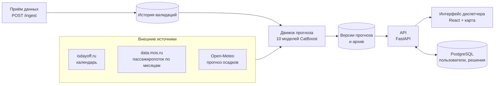
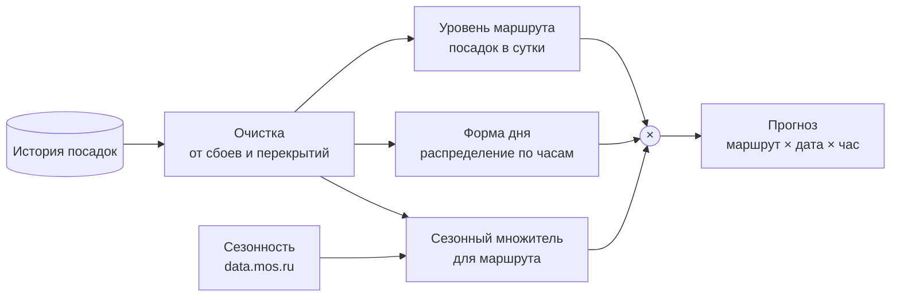

# Архитектура решения

**Коротко.** Модель прогнозирует посадки в трамваи Москвы по маршрутам и часам на горизонт от дня до года
(лидерборд, ноябрь–декабрь 2025: **WAPE-score 0,89136**). Сервис сам применяет модель к поступающим данным, сам скачивает
внешние данные и превращает прогноз в решения диспетчера: где будет давка, сколько вагонов выпустить, что делать сейчас.

## 1. Как устроена система

| Часть | Что делает | Где в коде |
|---|---|---|
| Движок прогноза | Применяет модель к истории, строит прогноз на 12 месяцев. Пересчитывает его при новых данных и раз в сутки | `service/engine/` |
| Внешние данные | Скачиваются при каждом пересчёте. Если источник недоступен, берётся кэш, затем встроенная копия | `service/engine/sources.py` |
| Версии прогноза | Каждый пересчёт сохраняется отдельно и подменяется целиком. Старые версии остаются в архиве для проверки точности | том `state` |
| API | Держит прогноз в памяти и отдаёт срезы. Считает рекомендации, план выпуска, точность | `service/api/` |
| PostgreSQL | Пользователи, журнал решений диспетчера, журнал приёма данных | контейнер `db` |
| Интерфейс | Обзор, оперативная ситуация, карта, загрузка вагонов, план выпуска, качество прогноза, журнал | `service/web/` |

Модель не запускается на каждый запрос: прогноз считается один раз (около 25 секунд) при поступлении данных.
Поэтому API отвечает за миллисекунды и держит больше тысячи запросов в секунду
([производительность](docs/PERFORMANCE_AND_FEATURES.md)).

## 2. Как модель считает прогноз

**Прогноз = уровень маршрута × форма дня × сезонный множитель.**

1. **Очистка.** Дни с перекрытиями, объединениями маршрутов и сбоями заменяются обычным значением для такого дня.
   Так модель не учится на аномалиях. Крупные случаи совпадают с объявлениями Дептранса.
2. **Уровень** — средние посадки маршрута в сутки за последние 56 дней очищенной истории.
3. **Форма дня** — как поездки распределены по часам. Её дают две модели CatBoost: одна смотрит на календарь (час, день
   недели, праздники, дни до и после выходных), вторая ещё и на длину светового дня. Осенью и зимой вечерний спрос
   сдвигается вместе с темнотой. Результат смешивается с профилем маршрута за последние 4 недели. В будни CatBoost весит
   60 %, в выходные 50 %, ночью 40 %. В праздничные будни к CatBoost добавляется профиль обычного воскресенья.
4. **Сезонность** — насколько месяц прогноза отличается от последнего месяца данных. Берётся по городской статистике
   трамвая за 2019 и 2021–2024 годы: ноябрь ×0,985, декабрь ×1,052 к октябрю. Для каждого маршрута множитель
   поправляется на то, насколько сильнее или слабее города он колебался в 2025 году.
5. **Особые дни.** Маршрут 5 — всегда 0: в данных по нему нет посадок. Рабочая суббота 1 ноября — среднее прогнозов
   пятницы и субботы.

Для горизонта больше двух месяцев форма дня дополнительно смешивается с формой того же месяца год назад. В ближайшие
16 дней прогноз снижается на 2,5 % в дни сильного дождя. К прогнозу прилагается коридор, в который факт попадает
в 8 случаях из 10.

Как получена модель и что дала каждая часть — [docs/MODEL.md](docs/MODEL.md), все проверки — [docs/TESTS.md](docs/TESTS.md).

## 3. Внешние данные и зависимость от них

| Источник | Зачем | Если недоступен |
|---|---|---|
| isdayoff.ru — производственный календарь | праздники, переносы, рабочие субботы | кэш, затем встроенная копия на 2022–2027 годы |
| data.mos.ru — пассажиропоток трамвая по месяцам | сезонные множители | кэш, затем встроенная копия до октября 2025 |
| Open-Meteo — прогноз осадков | поправка в дни сильного дождя | прогноз без поправки |
| Дептранс, GTFS, OpenStreetMap | проверка очистки, остановки, геометрия маршрутов | в работе не нужны, лежат в репозитории |

Сервис не останавливается из-за внешнего источника. Откуда взяты данные в текущем прогнозе, видно в `/model/info`.
Фактические данные ноября–декабря 2025 года нигде не используются. Подробно об источниках и их эффекте —
[docs/EXTERNAL_DATA.md](docs/EXTERNAL_DATA.md).

## 4. Где модель применима

- **Маршруты:** 9 маршрутов из обучающих данных (1, 7, 11, 12, 17, 25, 26, 28, 50). Для нового маршрута нужны 8 недель
  данных и переобучение.
- **Детализация:** маршрут × час. Суммы по дням, неделям и месяцам согласованы. По остановкам есть только оценка.
- **Горизонт:** от дня до 12 месяцев. Точность: на 1–2 недели около 0,90, на 2 месяца 0,891 (лидерборд), на 3–8 месяцев
  0,84–0,89.
- **Данные на входе:** почасовые успешные валидации, не меньше 8 последних недель.
- **Режим работы сети:** штатный. Будущие перекрытия и мероприятия модель не видит, они задаются сценарием.

Всё, что за этими рамками, — в [ограничениях](docs/LIMITATIONS_AND_ROADMAP.md).

## 5. Как модель адаптируется

| Что произошло | Что делать |
|---|---|
| Пришли новые данные | Ничего. Отправить их в `POST /ingest/*`, прогноз пересчитается сам |
| Новый год, новые праздники, свежая статистика города | Ничего. Календарь и сезонность скачиваются сами |
| Изменилась трасса или объединили маршруты | Уровень и профиль перестроятся по новым данным за 2–8 недель. До этого — сценарий в интерфейсе |
| Ремонт, мероприятие, непогода | Сценарный коэффициент в интерфейсе или параметр `coefficient` в API |
| Новый маршрут или прошло полгода | Переобучить одной командой: `python -m service.engine.train` |
| Упала точность | Видно на экране «Качество прогноза» и в предупреждениях. Проверить данные, затем переобучить |

## 6. Где что лежит

| Путь | Содержимое |
|---|---|
| [`model/`](model/) | итоговая модель: код обучения, отправленный сабмит и его md5 |
| [`service/`](service/) | веб-сервис: движок, API, интерфейс, Docker Compose |
| [`labels/`](labels/) | почасовые посадки январь–октябрь 2025 |
| [`external/`](external/) | внешние данные |
| [`experiments/`](experiments/) | журнал экспериментов |
| [`docs/`](docs/) | документация |
